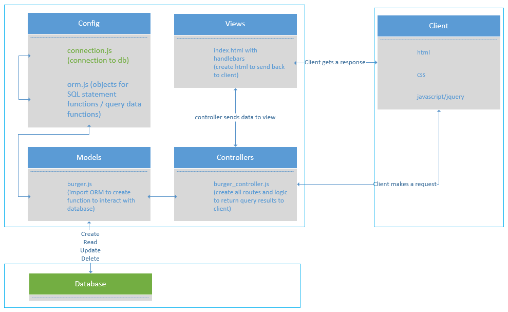
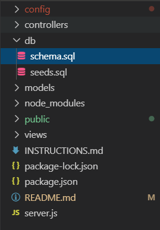

# Amazon-Like SQL
[](LICENSE)


## What is this repo?
This app is a burger consumption, where the user can create their favorite burger, interact to see if it has been devoured and delete it from the database. This is a great learning tool for beginner software engineer to understand the concept of ORM (Object-Relational Mapping) to query mysql data. Also, this app also introduce the concept of Model-View-Controller design pattern to structure the interconnected elements.

 

## How is this repo useful?
This is a great learning tool for node js/javascript/mySQL/Express-handlebars/Express beginners to get acquainted with the following concepts:

  * Learn about mysql driver in Node js. 
    * [mysql package](https://www.npmjs.com/package/mysql)
  * Learn about Express JS.
    * [express package](https://www.npmjs.com/package/express)
  * Learn about Express-handlebars.
    * [express-handlebars package](https://www.npmjs.com/package/express-handlebars)
  * The script is written in Node JS.
    * [Node JS](https://nodejs.org/en/)


## How to get Started?
1. clone the repository:
```git
git clone git@github.com:tmnguyen8/amazonSQL.git
```
* If your node js and npm installed, you can skip this step.
  * [Downloading and installing Node.js and npm](https://docs.npmjs.com/downloading-and-installing-node-js-and-npm)

2. Install the packages:
Navigate to your directory where this repo lives on your local machine and install the following packages:
```git
npm install --save express-handlebars
npm install --save express
npm install --save mysql
```

3. Create a database:
Create a localhost database for testing the app on your machine. The schema and seeds files are located in the following directory. Add a user name and password.

 

4. Deploy to Heroku and add JawsDB MySQL:
Create a localhost database for testing the app on your machine. The schema and seeds files are located in the following directory. Make sure you have a verified account with Heroku. Credit card will be required but as long as you select the free option, you will not be charged. Under Heroku app resources, look for JawsDB mySQL and add the add-ons to your app. 

    * [Deploy to Heroku](https://devcenter.heroku.com/articles/heroku-cli)


## How does this work?
1. The user has the functionality of create a new burger and determined if it has been devoured or not. The page will persist existing data of burgers from the database on the page. The user can eat the burger and the status will change to already eaten, which also update the database. Finally, the user can delete the burger as well.


## Contact

Visit my portfolio and contact page for any comments.
[https://tmnguyen8.github.io/portfolio/](https://tmnguyen8.github.io/portfolio/)


